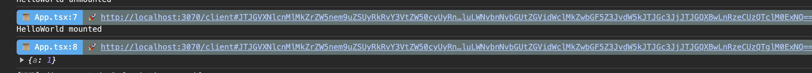

# rsbuild-plugin-console-debug

[](https://www.npmjs.com/package/rsbuild-plugin-console-debug)

## Install

```bash
npm i rsbuild-plugin-console-debug -D
```

<details>
<summary>Rsbuild</summary><br>

```ts
// rsbuild.config.ts
import { pluginConsoleDebug } from 'rsbuild-plugin-console-debug';

// install launch-editor-middleware
import launchEditorMiddleware from 'launch-editor-middleware';

export default defineConfig({
   dev: {
    setupMiddlewares: [
      ({ unshift }, server) => {
        unshift((req, res, next) => {
          if (req.url.startsWith('/__open-in-editor')) {
            launchEditorMiddleware()(req, res, next);
            return;
          }

          next();
        });
      },
    ],
  },

  plugins: [
    pluginConsoleDebug(),
  ],
});
```

Example: [`playground/`](./playground/)

<br></details>

## Reference

- [Rsbuild](https://rsbuild.dev/)

- [launch-editor](https://github.com/yyx990803/launch-editor)

## Demo


